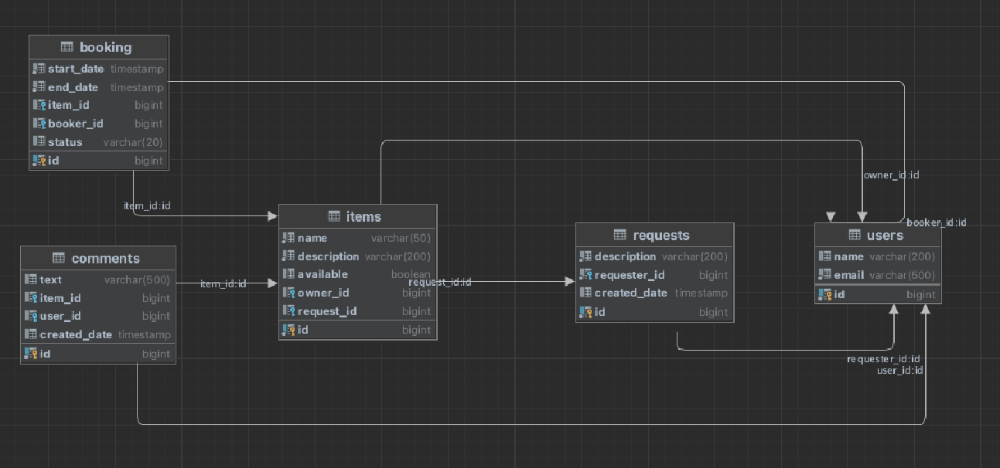

# ShareIt

Это бэкенд сервиса для шеринга вещей, который дает пользователям возможность рассказывать, какими вещами они готовы поделиться, а также находить нужную вещь и брать её в аренду на какое-то время.

____
Технологический стек:
* Java 11
* Spring Boot
* PostgreSQL
* H2
* Lombok
* Maven
* Hibernate
* Docker
* Mockito
____

В приложении реализована **микросервисная архитектура**:
* **Gateway** - принимает запросы от пользователей, распределяет нагрузку, выполняет первичную проверку и направляет запросы дальше в основной сервис.
* **Server** - серверная часть приложения, которая получает запросы, выполняет операции, отправляет данные клиенту.

В проекте реализованы следующие **классы-контроллеры**:
* ItemController для работы с вещами
* UserController – пользователями
* BookingController – бронированием
* ItemRequestController – запросами

В классах-контроллерах имеются эндпоинты с подходящим типом запроса для каждого из случаев.

ItemController:
* GET /items - получение списка вещей, добавленных текущим пользователем;
* GET /items/{itemId} - получение вещи по её идентификатору;
* GET /items/search - получение вещей по текстовому запросу;
* POST /items - добавление нового предмета для шеринга;
* PATCH /items/{itemId} - обновление информации о предмете;
* POST /items/{itemId}/comment - добавление комментария к предмету.

UserController:
* GET /users - получение списка всех пользователей;
* GET /users/{userId} - получение информации о пользователе по его идентификатору;
* POST /users - добавление нового пользователя;
* PATCH /users/{userId} - обновление информации о пользователе;
* DELETE /users/{userId} - удаление пользователя.

BookingController:
* GET /bookings - получение списка всех бронирований;
* GET /bookings/owner - получение списка бронирований, где пользователь является владельцем вещи;
* GET /bookings/{bookingId} - получение информацию о бронировании по его идентификатору;
* POST /bookings - создание бронирования;
* PATCH /bookings/{bookingId} - обновление статуса бронирования.

ItemRequestController:
* GET /requests - получение списка всех запросов на предмет, созданных текущим пользователем;
* GET /requests/all?from={from}&size={size} - получение списка всех запросов на предмет отсортированных по дате создания: от более новых к более старым;
* GET /requests/{requestId} - получение данных о запросе вместе с данными об ответах на него в том же формате, что и в эндпоинте;
* POST /requests - создание нового запроса на предмет.
____

В прооекте используется базы данных Postgres и Н2 (в режиме тестирования). 

____
# Установка и запуск проекта
1.Необходимо установить и запустить Docker Desktop(скачать и установить можно с официального сайта https://www.docker.com/products/docker-desktop/)

2.Клонируйте репозиторий проекта на свою локальную машину
 git clone https://github.com/gprovotorova/java-shareit.git

3.Зайдите в папку проекта в командой строке.

4.Соберите проект
mvn clean package

5.Запустите приложение
docker-compose up

# Тестирование:
В приложении ShareIt реализованы следующие тесты:

* Юнит-тесты покрывают ключевые компоненты, включая сервисы и контроллеры.
* Тесты REST-эндпоинтов обеспечивают корректность HTTP-запросов и взаимодействие с внешними системами.
* Тесты репозиториев проверяют слой доступа к базе данных и SQL-запросы.
* Тесты работы с JSON для DTO гарантируют правильность маппинга JSON-объектов.

